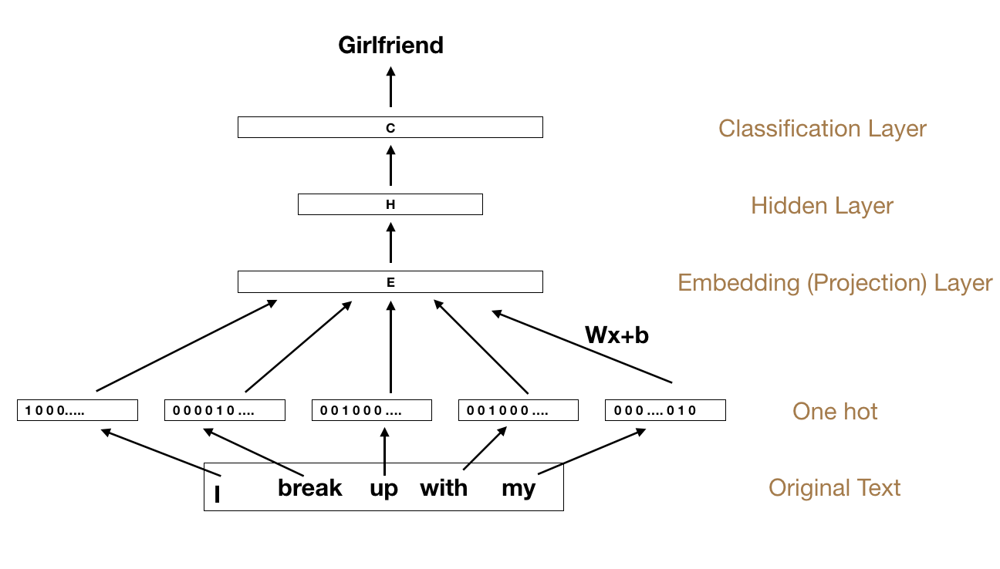

# RNN-and-FFNN-textClassification

The text classification by using RNN and FFNN with word_embedding. In this project, the classfication is established on the data set of TED talk.

I general, FFNN solution is trivial. In the RNN version, I self implement a RNN network without using the tensorflow pre defined cell of RNN. So the performance may not be as good as the  tensorflow version. But the RNN layers I create is easier to understand, hopefully this will help those who start to get in touch with NLP.

## Background Information

### Word Embedding

Word embedding is one of the most heated NLP subject, which basically create an function from word string to vector of higher dimensional. The embedding can be used in various NLP tasks and data visualization.

Word embedding can be generated in various way. In fact the most popular and fast way is to generate through a neural network of three layers, which itself serves as the language probilistic model to predict the next word. By previous word, we use n-gram to model, which basically take the previous several words to predict.

The object function, as used in Marklov's paper, is called negative sampling,  which maximize the probility of not choosing the word that is not correct by sampling:

### FNNN and RNN classification

Since we now only have the embedding for each word in the article, we still need to get the feature of the whole text in order to do the text clasification, in this task we try to clasificate the text into 8 different category.

Since we have pretrained model of word embedding of the whole text, we can look up the embedding of everyword in the model. The FFNN solution is straight forward, which directly sum up the embedding of the text field, which serve as the label of the whole text.

The RNN solution is a bit complicated. RNN, which stands for the recurrent neural network. In each cell we take the previous hidden layer and the current input to generate the new output.

In this project, we sum up all the hidden layer parameter to generate the embedding of the whole text.

## Install
The following python package is needed: `gensim`, `tensorflow`, `numpy`, `lxml`, `urllib`, `zipfile`, `progressbar2`.

